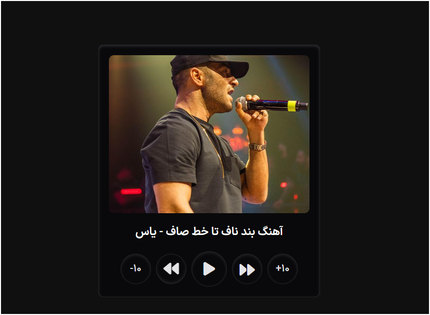

# 🎵 Music Player

A **simple and beautiful Music Player** built with **HTML, CSS, and JavaScript**.  
You can play/pause songs, skip forward/backward, and see the song's cover and title.

---

## 💡 Features

- Play and pause songs
- Skip forward/backward by 10 seconds
- Switch to the next or previous track
- Display song cover and title
- Supports MP3 audio files
- Uses **Git LFS** for managing large files (music & videos)

---

## 🖼️ Screenshots



---
⚙️ Technologies

HTML5

CSS3

JavaScript

Font Awesome

Git LFS for large files

---


## 📂 Project Structure

New folder/
│
├─ assets/
│ ├─ js/
│ │ └─ app.js
│ ├─ public/
│ │ ├─ cover1.jpg
│ │ ├─ cover2.jpg
│ │ ├─ cover3.jpg
│ │ ├─ musics/
│ │ │ ├─ bende-naf-ta-khate-saf.mp3
│ │ │ ├─ sarkoob.mp3
│ │ │ └─ sefareshi.mp3
│ │ ├─ fonts/
│ │ │ └─ [ttf files]
│ │ └─ css/
│ │ ├─ styles.css
│ │ └─ vid/
│ │ └─ Screen Recording.mp4
│
└─ index.html


---

## 🚀 Installation & Usage

1. Clone the repository:
```bash
git clone https://github.com/00mohammad/music-player.git
